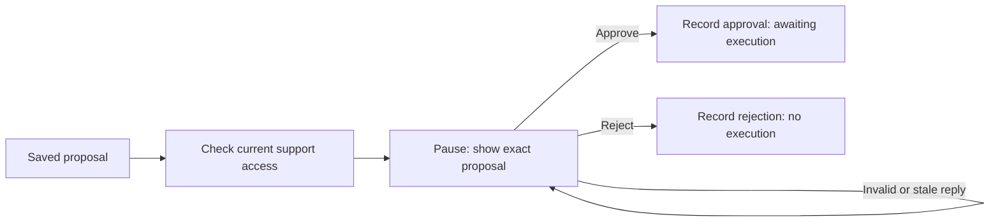

# Action approval (RF-307)

Kevin approved a reusable approval stage for an already saved proposal. It
requires authorized support identity and an exact action ID/version/fingerprint
match; actor and timestamp come from application code.
Kevin approved the implementation and important cases in the RF-307 PAIR review.
RF-308 now optionally connects [simulated execution](simulated-ticket-tool.md).
The default without an injected tool remains approval-only.



## Contracts

`ApprovalReply` accepts only action ID, positive integer version, fingerprint,
and `approve`/`reject`. Booleans, altered arguments, actor IDs, timestamps, and
unknown fields are rejected. `ApprovalDecision` saves these binding fields plus
the authenticated actor ID and a server-generated UTC decision timestamp.
Both contracts are immutable.

The interrupt payload contains the complete proposal: tool, exact arguments,
explanation, expected effect, risk, version, and idempotency key, plus its
fingerprint. It is internal support data, not a customer response.

Invalid or stale replies produce another interrupt with
`invalid_or_stale_approval`. No decision is recorded and no tool is invoked.
The support context callback is called again whenever the node resumes. It
must establish the current actor and authorize access to the run's report;
the stage also rejects any actor whose role is not `support`.

`record_approval` checks role and snapshot binding again before saving a receipt.
`ApprovalDecision.permits(proposal)` requires an approving decision matching the
entire current normalized snapshot. Changed arguments fail even if someone
reuses an action ID and version. A rejection never permits execution.

## Using the stage

The graph lives in `workflow/approval_graph.py`; guarded submissions use
`workflow/approval_runner.py`. Contracts live in
`workflow/approval.py`. Trusted orchestration supplies the proposal after the
appropriate customer confirmation and support review. This stage is separate
from intake and does not automatically propose actions after extraction.

```python
stage = build_approval_stage(load_current_support_context, checkpointer=saver)
config = approval_config(workflow_run_id)
state = await stage.ainvoke({
    "workflow_run_id": workflow_run_id,
    "issue_report_id": issue_report_id,
    "proposed_action": saved_proposal,
}, config, durability="sync")

runner = ApprovalRunner(
    stage, load_current_support_context,
    PostgresRunLocks(database_url, namespace="workflow"),
)
state = await runner.submit(workflow_run_id, {
    "action_id": str(saved_proposal.action_id),
    "version": saved_proposal.version,
    "fingerprint": saved_proposal.fingerprint(),
    "decision": "approve",
})
```

The stage uses `<run UUID>:approval` as its thread ID, separating its checkpoint
from the intake graph while retaining the same run identity. Keep the same
config on resume. Inject the PostgreSQL saver from
[checkpoint storage](workflow-checkpoints.md) for restart restoration; the
default is in-memory. Restored proposals and decisions retain their types,
fingerprints, idempotency keys, actor IDs, and timestamps.

Application integration must authenticate before reading checkpoints or
displaying interrupt data, and bind the actor, run, report, and stage thread.
Raw graph input/state updates are trusted application APIs, not client commands.
The stage validates that the proposal belongs to the run's report. Identity
and authorization are never inferred from the resume payload or checkpoint.

## Outcomes and execution boundary

- **Approved:** save `approval` and a safe `awaiting_execution` update. This
  means an exact proposal was approved; it does not claim ticket creation.
- **Rejected:** save `approval` and an `action_rejected` update, then finish
  this action path without execution or a support-ticket ID.
- **Unauthorized:** raise `PermissionError` without accepting a decision.

RF-307's approval-only stage executes no tool and makes no model call. RF-308
adds optional simulated execution, checking `permits` against the current saved
proposal and rechecking execution authorization. RF-309 adds the [guarded submission boundary](approval-edge-cases.md) for
duplicate, concurrent, failed, and resumed execution cases; RF-703 adds durable effect idempotency. A saved
approval alone cannot guarantee those behaviors.

The implementation uses LangGraph's dynamic interrupt and `Command(resume=...)`
pattern. The interrupted node starts again on resume, allowing current access
checks to run before accepting a decision. See the official
[interrupt documentation](https://docs.langchain.com/oss/python/langgraph/interrupts).

## Verification

Offline tests in `tests/workflow/test_approval.py` cover approval, rejection,
safe updates, stale bindings, changed arguments, forbidden identity fields,
current support role, revoked access, proposal/report mismatch, and typed
decision round trips. A PostgreSQL test starts a pause in one process, approves
it in another, and inspects the exact saved receipt in a third. No live model
or tool is involved.

Verification on 2026-09-26: `pnpm check` passed formatting, lint, generated client
drift checks, all type checks, and all 184 tests with PostgreSQL available.
