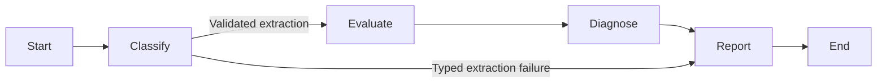

# Minimal workflow (RF-303)

Kevin approved the implemented behavior in the RF-303 PAIR review.
RF-304 extends this original four-node slice with the
[bounded clarification branch](workflow-clarification.md). The description below
records RF-303; use that branch's documentation for current pause/resume behavior.
RF-310 also adds an initialization node and checkpointed
[transition events](execution-timeline.md) to the current graph.

The application graph lives in `apps/api/src/api/workflow/graph.py`.
Its typed state and result contracts live in `workflow/state.py`.



## What each node does

- **Classify:** load the original report by ID through an injected, trusted
  loader, then call the existing extraction service. Save extraction and call
  metadata, or a safe typed failure. The existing retry budget remains in force.
- **Evaluate:** derive the clarification decision from the saved extraction.
- **Diagnose:** save a deterministic preliminary draft containing reported
  facts, missing data, and contradictions. Cause is unknown and evidence is
  unavailable; this does not claim a verified diagnosis.
- **Report:** return `needs_clarification`, `needs_confirmation`, or
  `extraction_failed` with a fixed safe message and the selected questions.
  A gap with no proposed question stays visible with an empty question list.

The report contains no internal diagnosis or raw provider error. Proposed
questions are customer-directed model output; they are not independently
verified. No second model call is used for diagnosis or reporting.

## Calling the graph

```python
graph = build_workflow(load_report, provider)
config = {"configurable": {"thread_id": str(workflow_run_id)}}
state = await graph.ainvoke({
    "workflow_run_id": workflow_run_id,
    "issue_report_id": issue_report_id,
}, config)
customer_update = state["customer_update"]
```

`load_report` is an async callable receiving the report UUID. The caller must
provide a loader that enforces the current actor's access scope before returning
text. Lookup or access errors propagate and prevent a model call. This ticket
does not introduce a database loader, HTTP endpoint, or a new authorization
policy. Original report text, provider objects, and access context are kept out
of graph state. Only the two IDs are accepted by the graph input schema.

The returned state and raw graph streams are internal; an HTTP/UI integration
must explicitly expose the customer update instead of returning all state.

## Scope and tests

The original RF-303 invocation completed with a status. RF-304 now introduces
clarification interrupts; provider-failure retry is not implemented by this
branch. RF-305 adds durable checkpoints. Confirmation, retrieval, approvals, and tools retain
their boundaries in [workflow transitions](workflow-transitions.md).

Offline tests in `apps/api/tests/workflow/test_graph.py` verify node order,
clear reports, clarification with and without a question, unchanged reported
facts, unknown cause, failure routing, safe errors, bounded retries, and access
denial before extraction. They do not call a live model.

The implementation follows the [LangGraph Graph API](https://docs.langchain.com/oss/python/langgraph/graph-api):
nodes return partial updates to a `TypedDict` state, edges route execution, and
the builder compiles before invocation. A few local Pyright suppressions cover
LangGraph's missing stubs and partially typed API methods; application types
remain checked in strict mode.

## Verification (2026-09-26)

After Docker was re-enabled and PostgreSQL was healthy, `pnpm check` passed
formatting, lint, generated client drift checks, all type checks, and all 127
tests, including the seven new graph tests and database integration tests.
The earlier database availability blocker is resolved.
