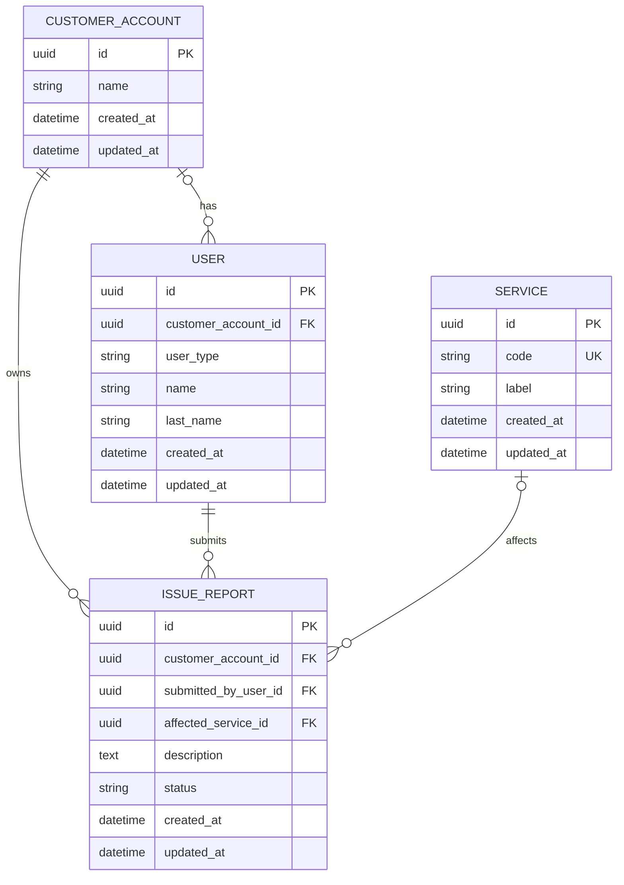

# Initial relational schema (RF-103 draft)

This diagram covers the first issue-report persistence milestone. The tables and
constraints below are design decisions, not migrations yet.

## Constraints already agreed

- `issue_report.customer_account_id` and `submitted_by_user_id` are required.
- `user.user_type` is `customer` or `support`. A customer user must have one
  `customer_account_id`; a support user has no customer account. The foreign
  key is nullable because support users exist outside customer accounts. A
  database check constraint enforces this type/account combination.
- A customer may submit a report only for their own account. A support user may
  submit one on an account's behalf only when explicitly authorized.
- `affected_service_id` is nullable: a customer may not know the service.
- An issue-report description has 1–5,000 characters after trimming whitespace.
- Service codes are unique.
- Report status is one of `draft`, `submitted`, `in_review`, `linked`,
  `deleted`, or `closed`.
- IDs use PostgreSQL `uuid`. Timestamps use `timestamptz` and represent UTC.
- The original submitted description is retained; updates do not overwrite it.

## Creation and update policy

- A report is first persisted after the customer confirms it. Application code
  explicitly sets its initial status to `submitted`; the database has no status
  default. `draft` remains available if unfinished intake is persisted later.
- PostgreSQL generates IDs with `gen_random_uuid()` defaults. The `uuid` column
  type remains suitable if a different UUID version is generated later.
- PostgreSQL sets `created_at` and `updated_at` when a row is inserted. Both are
  required. Application write paths set `updated_at` when a row is changed.
- Reports are archived by setting their status to `deleted`. Other records that
  need to disappear from normal views will use soft deletion when implemented;
  the field and query behavior for each record will be designed with that work.
- Initial foreign keys use `ON DELETE RESTRICT`: a referenced customer account,
  user, or service cannot be physically deleted while dependent users or issue
  reports exist. This preserves report history. Soft deletion does not activate
  foreign-key delete rules.

## Report creation access rule

- The application establishes the submitting user and their `RequestContext`;
  neither the request body nor an LLM may choose `submitted_by_user_id`.
- For a customer user, the application copies `customer_account_id` from the
  context. A customer cannot submit a report for another account.
- A support user may specify a target account only when the context grants
  permission to submit on that account's behalf. Otherwise creation is denied.
- The application checks these rules before insertion. Database foreign keys
  ensure the referenced account and user exist but do not grant access. RF-106
  will implement and test the allowed and denied creation paths.
