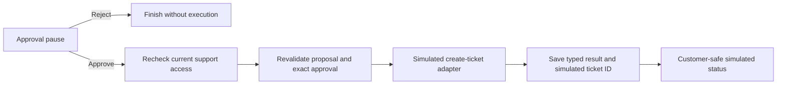

# Simulated create-ticket tool (RF-308)

Kevin approved a deterministic simulated ticket result, without a database
ticket write, connected to the saved-proposal approval stage. The approval-only
stage remains available when no tool is injected.
Kevin approved the implementation and important cases in the RF-308 PAIR review.



## Application boundary

`execute_approved_action` in `workflow/execution.py` revalidates the frozen
proposal and approval contracts, requires a current support context, and checks
`approval.permits(proposal)` before dispatch. Missing approval, rejection,
changed arguments, and stale versions prevent the adapter call. Context must
already be scoped to the proposal's report by trusted application code.

The approval stage calls its trusted context loader again in the execution
node, after the approval receipt has been saved. It checks the proposal's report
ID against the run and then uses this application boundary. Approval does not
replace the current execution-access check, and the executing support operator
does not have to be the same person who approved it.

## Deterministic adapter and result

`SimulatedCreateTicketTool` accepts validated `CreateTicketArguments` and the
saved idempotency UUID. It generates a UUID5 using that key and the fixed name
`resolveflow-simulated-create-ticket`. The same key returns the same fake ID;
a revised proposal's new key returns a different ID.

`SimulatedTicketResult` contains `support_ticket_id`, status `open`, and
`simulated=True`. `ToolExecutionResult` records the action ID/version/fingerprint,
idempotency key, executing actor, and that typed result. The adapter makes no
model call, database ticket write, or external request. Its `calls` list is
in-memory test instrumentation.

The simulated UUID is not a persisted `SupportTicket` record and cannot be used
to retrieve a real ticket from the database. A real local ticket schema/write
is separate work. Repeated adapter calls produce equal fake results; this does
not claim durable execution idempotency for real effects. RF-309 tests execution
edge cases and RF-703 implements that durable boundary.

## Connecting execution

```python
tool = SimulatedCreateTicketTool()
stage = build_approval_stage(load_current_support_context,
                             checkpointer=saver, tool=tool)
```

Starting and resuming use the [RF-307 approval contract](action-approval.md).
With the tool injected, approval proceeds to execution and saves
`tool_execution` and `support_ticket_id`. The final customer update has status
`simulated_ticket_created` and explicitly describes a simulated ticket.
Rejection never calls the adapter or sets a ticket ID.

Without a tool, approval still returns `awaiting_execution`, preserving the
standalone approval stage. The intake graph does not automatically create
proposals or skip customer confirmation/support review.

Invalid contracts and authorization failures propagate safely before dispatch;
they do not produce a success result. If access is revoked between approval and
execution, the approval receipt may be saved while no execution result exists.
RF-309 now saves a sanitized tool failure with outcome unknown and does not
automatically retry. Submit approval through the
[guarded runner](approval-edge-cases.md). A future API integration must project only customer-safe
status and selected simulated identifier fields, never the whole internal state.

## Verification

Offline tests cover deterministic results, changed revision keys, typed result
restoration, rejection/missing/stale approval, changed arguments, customer denial,
invalid unvalidated arguments, approval-to-execution routing, and revoked access
between approval and dispatch. PostgreSQL tests pause in one process, approve
and simulate in a second, then restore the exact execution result in a third
without another adapter call. No live model or external tool is required.

Verification on 2026-09-26: `pnpm check` passed formatting, lint, generated client
drift checks, all type checks, and all 195 tests with PostgreSQL available.
