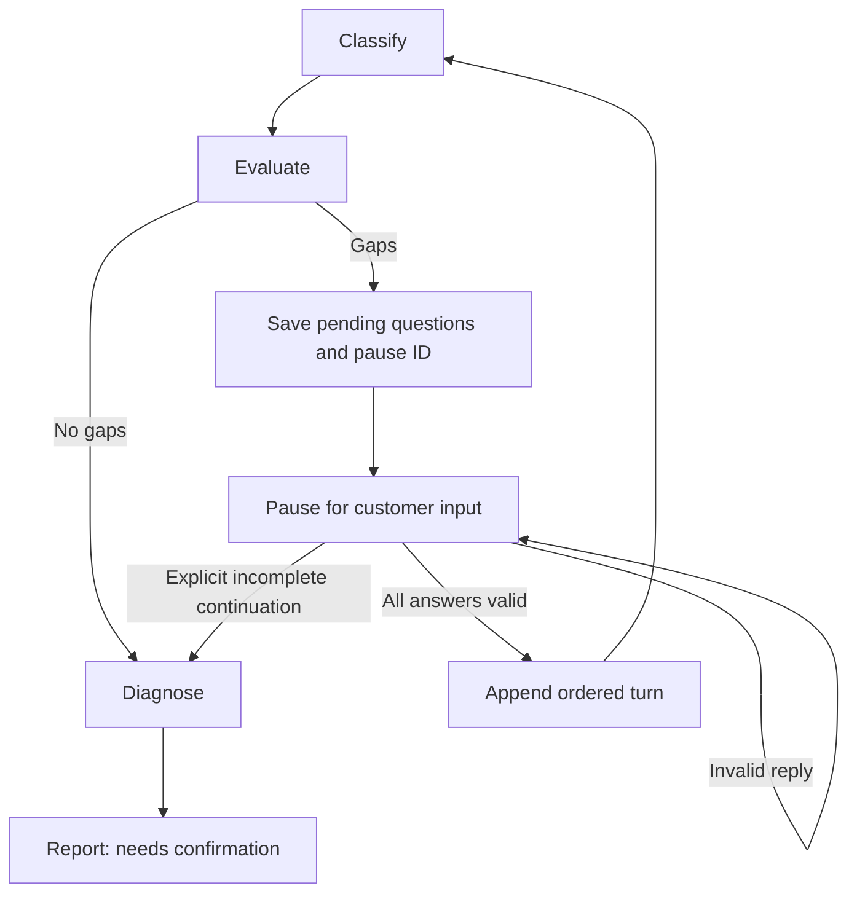

# Workflow clarification (RF-304)

The graph now pauses for customer input when the saved extraction has gaps.
Kevin approved two rounds, at most two questions per round, answers to every
displayed question, and explicit incomplete continuation at any pause.
Kevin approved the implementation and edge cases in the RF-304 PAIR review.



## Round rules

- A round is counted when a complete set of answers is accepted. Each accepted
  turn saves its number, questions, and answers in order.
- A reply must match the saved `pending_id` and contain one nonempty answer per
  displayed question, in question order. Whitespace is trimmed. Unknown fields,
  stale IDs, partial answers, and malformed replies trigger another pause with
  `invalid_reply`; they do not append answers or call the model.
- After two answered rounds, or when the model proposes no question, the pause
  is `continue_only`. It contains the unresolved reasons but no invented question.
  There is no third answer round and no automatic continuation.
- `continue_incomplete` requires an explicit reply with no answers. It does not
  run extraction again. The saved gaps and contradictions remain in the draft,
  and the customer report has `incomplete=True` and `needs_confirmation` status.
- Accepted answers trigger one new extraction using the immutable original
  report and all accepted turns as structured JSON. Prompt version 3 explains
  that questions are context and answers are customer-reported observations.

## Pause and resume

`build_workflow` compiles with an `InMemorySaver`. Keep the same graph object and
use the workflow run ID as the thread ID. State survives a pause within that
process; RF-305 adds durable storage and tests process restart.
RF-305 now provides [PostgreSQL checkpoints](workflow-checkpoints.md) when a saver
is explicitly injected. This section's default in-memory example still applies.

```python
config = {"configurable": {"thread_id": str(workflow_run_id)}}
state = await graph.ainvoke({
    "workflow_run_id": workflow_run_id,
    "issue_report_id": issue_report_id,
}, config)
# If interrupted, display the pending questions and explicit continuation option.
pending = state["pending_clarification"]
state = await graph.ainvoke(Command(resume={
    "pending_id": str(pending.pending_id),
    "action": "answer",
    "answers": ["Two payments", "Both still pending"],
}), config)
# Alternative at any pause:
# Command(resume={"pending_id": str(pending.pending_id),
#                 "action": "continue_incomplete"})
```

`Command` comes from `langgraph.types`. Pending questions, ID, mode, and reasons
are also returned in the JSON interrupt payload. The customer-safe update is
`needs_clarification` while waiting; no diagnosis is produced until gaps resolve
or incomplete continuation is accepted.

LangGraph resumes by re-entering the interrupted node. Saving the pending
questions in a separate node keeps their ID stable. Model calls and answer
appends occur outside the code that replays before `interrupt()`, so ordinary
pause/resume does not repeat them. See the official
[interrupt documentation](https://docs.langchain.com/oss/python/langgraph/interrupts).

The trusted loader checks current access again before a resumed answer can be
accepted, including incomplete continuation. Future HTTP integration must bind
the authenticated actor, run, report, and thread ID; raw graph commands are an
internal API and must not be accepted directly from customers. Approval of an
action, customer confirmation, and provider-failure retry remain separate work.

## Offline verification

`tests/workflow/test_clarification_loop.py` exercises resolution after an answer,
two-round exhaustion, no-question gaps, explicit continuation, polling without
extra extraction, stale/partial/blank/malformed replies, replay of an earlier
round's reply, access denial on resume, and extraction failure after an answer.
No live model calls are used. These tests check orchestration and preserved data;
they do not establish whether a model interprets customer answers correctly.

Verification on 2026-09-26: `pnpm check` passed formatting, lint, generated client
drift checks, all type checks, and all 138 tests with local PostgreSQL available.
