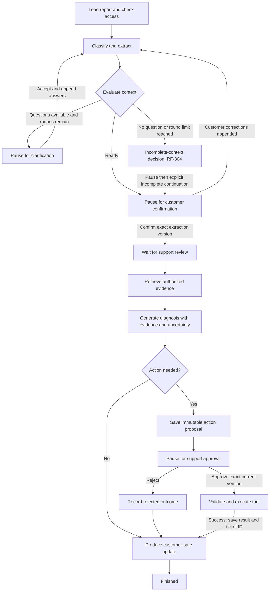
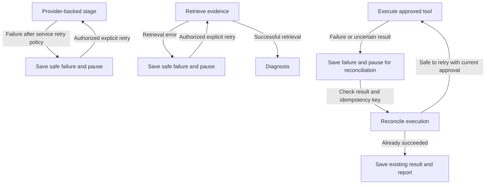

# Workflow transitions (RF-302)

This is the target design for a run starting from an existing issue report.
Kevin approved pausing on provider/retrieval failure for explicit retry, ending
on action rejection, and returning customer corrections to extraction.
Kevin approved the completed diagrams and resume rules in the RF-302 PAIR review.
The full graph is not implemented yet; RF-303 adds the four-node subset described
in [minimal workflow](minimal-workflow.md). [Workflow state](workflow-state.md) defines
the saved values; RF-305 adds persistence across process restarts.

## Normal, clarification, and rejection paths

Clarification answers and customer corrections supplement the immutable original
report. A deliberate new extraction creates a new proposal; ordinary resume
keeps the saved proposal. Confirmation binds to that exact extraction version.
Changed input invalidates downstream confirmation, evidence, diagnosis, action,
and approval before those stages run again.

RF-304 implements at most two answered rounds and an explicit incomplete-context
decision, including a gap with no proposed question. See
[workflow clarification](workflow-clarification.md). Incomplete continuation preserves visible uncertainty;
it does not invent an answer. This branch cannot loop without a bound.

The support queue marks the change of actor before internal retrieval. A customer
cannot resume the run as an internal operator. Rejection finishes the action
path without executing a tool or setting `support_ticket_id`.

## Failure and explicit retry paths

| Event | Behavior | Resume target |
| --- | --- | --- |
| Provider timeout or transient failure | Use RF-207's bounded retries, then save the failed stage and safe reason; pause. No extra graph retry layer. | Explicit retry of the failed stage, with a fresh bounded service invocation. |
| Permanent provider failure, refusal, empty or invalid output | Save the typed reason and pause immediately. No automatic repair or repeated identical calls. | Explicit operator retry after reviewing the cause; a refusal is never permission to bypass provider policy. |
| Retrieval error | Save failure and pause; do not generate a diagnosis from a failed retrieval. | Retry retrieval; retain the confirmed extraction. |
| Successful retrieval with no results | Save an empty evidence result, distinguish it from an infrastructure failure, and expose missing evidence. | Evidence adequacy and unsupported-claim rules are defined in RF-409/410 before this branch is implemented. |
| Tool error or uncertain outcome | Save failure; do not claim a ticket was created or blindly execute again. | Reconcile using the action's idempotency key before any retry; detailed cases belong to RF-309/703. |
| Invalid, stale, duplicate, or unauthorized resume input | Reject the input without advancing the run or performing effects. | Remain at the current pending step; approval cases are tested in RF-309. |

Earlier successful values remain saved after a failed step. A successful retry
resolves the active failure while its history remains available to the later
RF-310 timeline. Customer updates use safe reason codes, never SDK errors or
internal evidence text.

## Resume rules

| Waiting at | Accepted input | What happens next |
| --- | --- | --- |
| Clarification | Answers tied to the pending questions and round | Append once, extract using original report plus accepted answers, then evaluate. |
| Customer confirmation | Confirmation of the current version, or corrections | Confirm and enter support queue, or append corrections and extract again. |
| Support queue | Authorized support operator starts review | Retrieve within the operator's current access scope. |
| Approval | Support decision tied to exact current action and arguments | Reject and report, or revalidate authorization/approval and execute. |
| Failed stage | Authorized explicit retry after cause review | Repeat only the failed stage; preserve completed upstream drafts. |

Resume checks the current actor and pending step against the saved run. It does
not restart from the beginning, rerun completed model calls, or interpret a
checkpoint as permission to execute. Evidence access must still be valid when
saved evidence is used; approval and tool idempotency must still be checked.
Restart restoration requires RF-305; duplicate-effect prevention requires the
tool boundary as well.

## Review examples

- Clear report: extract → confirm → support → retrieve → diagnose → approve →
  execute → safe update.
- Ambiguous report: extract → clarification pause → answers → new extraction →
  confirm. Refreshing while waiting keeps the same unanswered questions.
- Customer correction: correction → new extraction → new confirmation;
  approval of an old proposal cannot carry forward.
- Rejected action: rejection → safe update → finished; no tool call or ticket ID.
- Provider failure: exhausted retry budget → pause → explicit retry of the
  failed stage; saved upstream results stay unchanged.
- Retrieval failure: pause → retry retrieval; confirmation is preserved and
  diagnosis waits for successful retrieval.

RF-303 implements the minimal classify/evaluate/diagnose/report subset. RF-304
adds clarification pauses with an in-memory checkpointer. Durable persistence
is now available through RF-305's explicitly injected PostgreSQL checkpointer.
RF-307 adds a separate approval stage for saved proposals. Customer confirmation
and retrieval are introduced in their own tickets. RF-308 adds optional simulated
execution after approval; it creates no database ticket row. This diagram does
not claim the remaining target features already exist.
